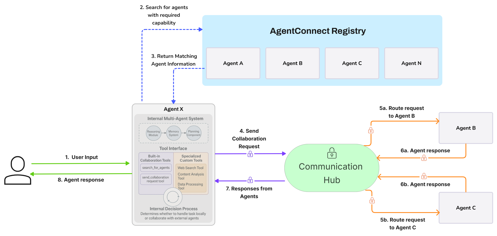

# AgentConnect

<div align="center">

<picture>
  
</picture>

*A Decentralized Framework for Autonomous Agent Collaboration*

**Build and connect independent AI agents that discover, interact, and collaborate securely.**

[](https://github.com/AKKI0511/AgentConnect/actions/workflows/main.yml)
[![Docs]]
[![Documentation]]
[](https://www.python.org/downloads/)
[](https://python-poetry.org/)
[](https://opensource.org/licenses/Apache-2.0)

[Installation](#quick-start) •
[Documentation](https://AKKI0511.github.io/AgentConnect/) •
[Examples](#examples) •
[Contributing](CONTRIBUTING.md)

</div>

## 📖 Overview

**AgentConnect provides a framework for building decentralized networks of truly autonomous AI agents, enabling the next generation of collaborative AI.**

Move beyond traditional, centrally controlled systems and embrace an ecosystem where independent agents can:

*   **Discover peers on-demand:** Locate partners via **capability broadcasts** instead of hard-wired endpoints.
*   **Interact Securely (A2A):** Leverage built-in cryptographic verification for **trustworthy Agent-to-Agent** communication.
*   **Execute Complex Workflows:** Request services, exchange value, and achieve goals collectively.
*   **Autonomous Operation:** Each agent hosts its own logic—no central brain required.
*   **Scale Limitlessly:** Support thousands of agents interacting seamlessly.

### Why AgentConnect?

AgentConnect delivers unique advantages over classic multi-agent approaches:

*   **Decentralized Architecture:** No central router, no single point of failure.
*   **First-class agent autonomy:** Agents negotiate, cooperate, and evolve independently.
*   **Interconnect Agent Systems:** Operates above internal frameworks, linking entire agent swarms.
*   **Living ecosystem:** The network fluidly adapts as agents join, leave, or evolve their skills.
*   **Secure A2A Communication:** Crypto-grade identity & message signing baked in.
*   **Horizontal scalability:** Engineered for planet-scale agent populations.
*   **Plug-and-play extensibility:** Easily integrate custom agents, capabilities, and protocols.
*   **Integrated Agent Economy:** Seamless A2A payments powered by **Coinbase CDP & AgentKit**.


## ✨ Key Features

<table>
  <tr>
    <td width="33%">
      <h3>🤖 Dynamic Agent Discovery</h3>
      <ul>
        <li>Capability-Based lookup</li>
        <li>Decentralized Registry</li>
        <li>Zero static links</li>
      </ul>
    </td>
    <td width="33%">
      <h3>⚡ A2A Communication</h3>
      <ul>
        <li>Direct Agent-to-Agent Messaging</li>
        <li>Cryptographic signatures</li>
        <li>No routing bottlenecks</li>
      </ul>
    </td>
    <td width="33%">
      <h3>⚙️ True Agent Autonomy</h3>
      <ul>
        <li>Independent Operation & Logic</li>
        <li>Self-Managed Lifecycles</li>
        <li>Unrestricted Collaboration</li>
      </ul>
    </td>
  </tr>
  <tr>
    <td>
      <h3>🔒 Trust Layer</h3>
      <ul>
        <li>Verifiable identities</li>
        <li>Tamper-proof messages</li>
        <li>Standard Security Protocols</li>
      </ul>
    </td>
    <td>
      <h3>💰 Built-in Agent Economy</h3>
      <ul>
        <li>Autonomous A2A Payments</li>
        <li>Coinbase CDP Integration</li>
        <li>Instant service settlement</li>
      </ul>
    </td>
    <td>
      <h3>🔌 Multi-LLM Support</h3>
      <ul>
        <li>OpenAI, Anthropic, Groq, Google</li>
        <li>Flexible AI Core Choice</li>
        <li>Vendor-Agnostic Intelligence</li>
      </ul>
    </td>
  </tr>
  <tr>
    <td>
      <h3>📊 Deep Observability</h3>
      <ul>
        <li>LangSmith tracing</li>
        <li>Monitor tools & payments</li>
        <li>Custom Callbacks</li>
      </ul>
    </td>
    <td>
      <h3>🌐 Dynamic Capability Advertising</h3>
      <ul>
        <li>Agent Skill Broadcasting</li>
        <li>Market-Driven Discovery</li>
        <li>On-the-Fly Collaboration</li>
      </ul>
    </td>
    <td>
      <h3>🔗 Native Blockchain Integration</h3>
      <ul>
        <li>Coinbase AgentKit Ready</li>
        <li>On-Chain Value Exchange</li>
        <li>Configurable networks</li>
      </ul>
    </td>
  </tr>
</table>

## 🚀 Quick Start

```bash
# Clone the repository
git clone 
cd AgentConnect

# Install dependencies
poetry install --with demo,dev

# Set up environment
copy example.env .env  # Windows
cp example.env .env    # Linux/Mac
```

Set required environment variables in your `.env` file:
```
# Required for AI providers (at least one)
OPENAI_API_KEY=your_openai_api_key
# Optional for payment capabilities
CDP_API_KEY_NAME=your_cdp_api_key_name
CDP_API_KEY_PRIVATE_KEY=your_cdp_api_key_private_key
```

For detailed installation instructions and configuration options, see the [QuickStart Guide](docs/source/quickstart.md) and [Installation Guide](docs/source/installation.md).

## 🎮 Usage

For detailed instructions on using AgentConnect, including the command-line interface, running examples, and building your own agents, see the [full documentation](https://AKKI0511.github.io/AgentConnect/).

*   [Running Examples](examples/README.md)
*   [Using the CLI](docs/source/usage.md)  *(To be created)*
*   [Building Custom Agents](docs/source/building_agents.md) *(To be created)*

## 💻 Examples
AgentConnect includes several example applications to demonstrate different features:

- **Basic Chat**: Simple human-agent interaction
- **Multi-Agent System**: Collaborative agent workflows
- **Research Assistant**: Task delegation and information retrieval
- **Data Analysis**: Specialized data processing
- **Telegram Assistant**: Telegram AI agent with multi-agent collaboration
- **Agent Economy**: Autonomous workflow with automatic cryptocurrency payments between agents

For code examples and detailed descriptions, see the [Examples Directory](examples/README.md).

## 🚀 Demo Application
A full-featured demo application is included to showcase the framework's capabilities:

> **Note:** The UI demo is currently being refactored for a new version with improved features and better integration with the modular multi-agent system. In the meantime, we recommend using the CLI examples.

```bash
# Start the backend server
agentconnect --demo --backend-only

# Start the frontend (in a separate terminal)
cd demos/ui/frontend
npm install
npm run dev
```
For more information about the demo application, see the [Demo Documentation](demos/QUICKSTART.md).

## 🏗️ Architecture

AgentConnect is built on three core pillars that enable decentralized agent collaboration:

1.  **Decentralized Agent Registry:**  A registry that allows agents to publish their capabilities and discover other agents.  This is *not* a central controller, but rather a directory service.  Agents can query the registry to find other agents that meet their needs.
2.  **Communication Hub:**  A message routing system that facilitates secure communication between agents.  The hub ensures reliable message delivery, but does *not* dictate agent behavior or control the network.
3.  **Independent Agent Systems:**  Each agent is a self-contained unit, built using the tools and frameworks of the developer's choice (LangGraph, custom logic, etc.).  Agents interact with the network through standardized protocols, but their internal workings are independent.

This architecture allows for a truly decentralized and scalable network of autonomous agents.



## 📊 Monitoring with LangSmith

AgentConnect integrates with LangSmith for comprehensive monitoring:

1.  **Set up LangSmith**
    *   Create an account at [LangSmith](https://smith.langchain.com/)
    *   Add your API key to `.env`:
        ```
        LANGSMITH_TRACING=true
        LANGSMITH_API_KEY=your_langsmith_api_key
        LANGSMITH_PROJECT=AgentConnect
        ```

2.  **Monitor agent workflows**
    *   View detailed traces of agent interactions
    *   Debug complex reasoning chains
    *   Analyze token usage and performance
    *   Track payment tool calls from AgentKit integration

## 🛠️ Development

For developers who want to contribute to AgentConnect, please refer to our [Development Guidelines](docs/DEVELOPER_GUIDELINES.md) for information about:

*   Coding standards
*   Documentation requirements
*   Testing procedures
*   Git workflow
*   Continuous integration

## 📚 Documentation

- [Online Documentation]() - Full documentation hosted on GitHub Pages
- [QuickStart Guide](docs/source/quickstart.md) - Get started quickly with basic concepts
- [Examples](examples/README.md) - Sample code and use cases
- [API Reference](docs/source/api/index.rst) - Detailed API documentation
- [Development Guidelines](docs/DEVELOPER_GUIDELINES.md) - Guidelines for contributors

## 📋 Project Structure

```
AgentConnect/
├── agentconnect/           # Core framework
│   ├── __init__.py        # Package initialization with public API
│   ├── cli.py             # Command-line interface
│   ├── agents/            # Agent implementations
│   ├── communication/     # Communication protocols
│   ├── core/              # Core components
│   ├── prompts/           # Prompt templates
│   ├── providers/         # AI provider integrations
│   └── utils/             # Utilities
├── demos/                 # Demo applications
│   ├── api/              # FastAPI backend
│   └── ui/               # React frontend
├── examples/              # Example applications
├── docs/                  # Documentation
└── tests/                 # Test suite
```

## 🗺️ Roadmap

- ✅ **MVP with basic agent-to-agent interactions**
- ✅ **Autonomous communication between agents**  
- ✅ **Capability-based agent discovery**
- ✅ **Coinbase AgentKit Payment Integration**
- ⬜ **Agent Identity & Reputation System**
- ⬜ **Asynchronous Agent Collaboration System**
- ⬜ **Marketplace-Style Agent Discovery**
- ⬜ **MCP Integration**
- ⬜ **Structured Parameters SDK**
- ⬜ **Secure data exchange protocols**
- ⬜ **Additional AI provider integrations**
- ⬜ **Advanced memory systems (Redis, PostgreSQL)**
- ⬜ **Federated learning capabilities**
- ⬜ **Cross-chain communication support**

## 🤝 Contributing

We welcome contributions to AgentConnect! Please read our [Contributing Guidelines](CONTRIBUTING.md) for details on our code of conduct and the process for submitting pull requests.

## 📄 License

This project is licensed under the Apache 2.0 License - see the [LICENSE](LICENSE) file for details.

## 📝 Changelog

See the [Changelog](CHANGELOG.md) for a detailed history of changes to the project.

## 🙏 Acknowledgments

- Inspired by the need for independent autonomous multi-agent collaboration with dynamic agent discovery
- Thanks to all contributors who have helped shape this project


---

<div align="center">
  <sub>Built with ❤️ by the AgentConnect team</sub>
</div>
