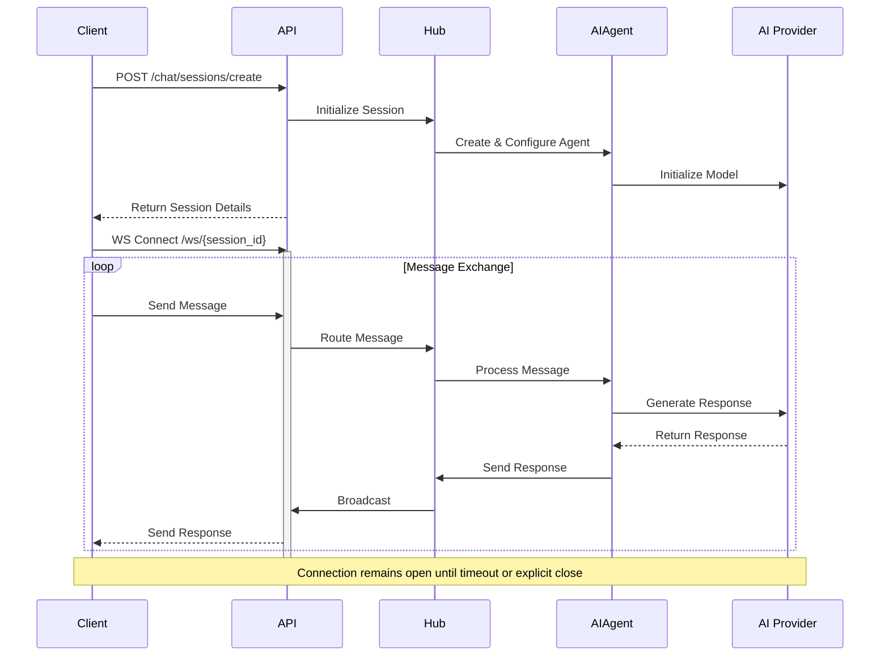
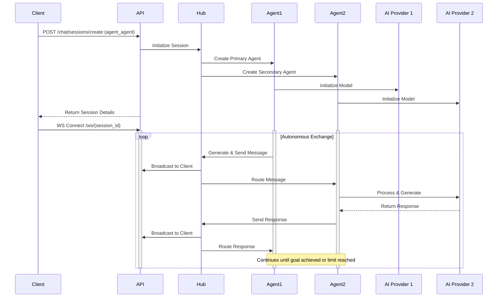
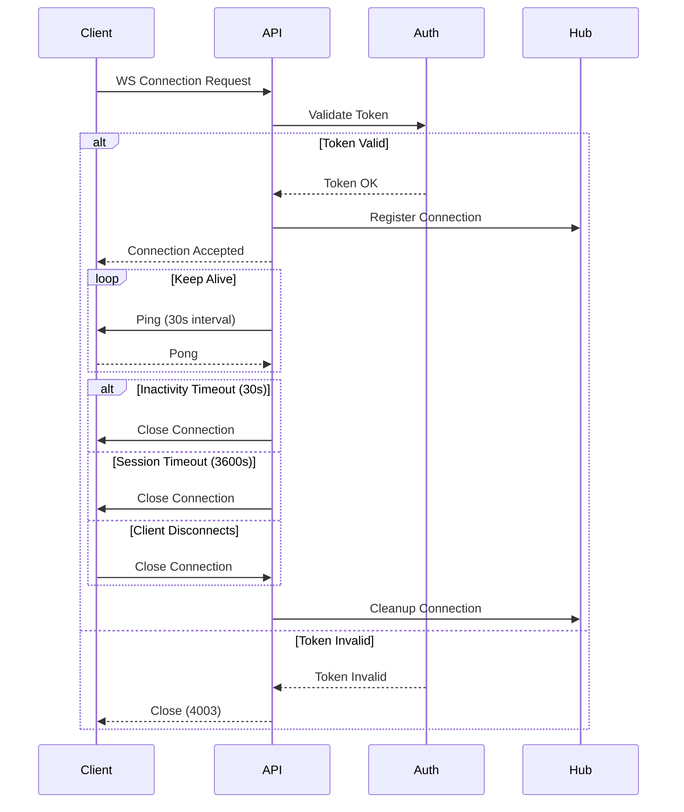

# AgentConnect API Documentation

## Overview
The AgentConnect API provides a WebSocket-based communication system with REST endpoints for managing AI agent interactions. Built with FastAPI, it supports multiple AI providers and implements secure authentication.

## Interaction Patterns

### Human-Agent Communication
The system enables real-time communication between human users and AI agents through WebSocket connections:



Key Features:
- Real-time bidirectional communication
- Automatic message routing
- Provider-agnostic interface
- Session state management
- Automatic cleanup on inactivity

### Agent-Agent Communication
Enables autonomous communication between AI agents with real-time monitoring:



Key Features:
- Autonomous interaction
- Multi-provider support
- Real-time monitoring
- Structured data exchange
- Configurable interaction patterns

### WebSocket Connection Lifecycle



Key Features:
- Token-based authentication
- Automatic keep-alive
- Timeout handling
- Clean disconnection
- Resource cleanup

## Base URL
```
http://127.0.0.1:8000/api
```

## Authentication

### Token-Based Authentication
All endpoints require JWT authentication:
```http
Authorization: Bearer <token>
```

### Login
```http
POST /auth/login
Content-Type: application/x-www-form-urlencoded

username=<username>&password=<password>
```

**Response:** `200 OK`
```typescript
interface Token {
    access_token: string;
    token_type: "bearer";
    expires_in: number;  // Seconds until expiration
}
```

**Errors:**
- 401: Invalid credentials
- 422: Validation error
- 429: Too many attempts

### Verify Token
```http
POST /auth/verify
Authorization: Bearer <token>
```

**Response:** `200 OK`
```typescript
interface TokenVerification {
    valid: boolean;
    user: string;
    type: "access";
    exp: number;
    iat: number;
    timestamp: string;
}
```

**Errors:**
- 401: Invalid or expired token
- 422: Malformed token
- 429: Too many attempts (10 requests/minute)

## WebSocket Communication

### Connection
Connect to: `ws://127.0.0.1:8000/api/chat/ws/{session_id}`

Authentication options:
1. Query parameter: `?token=<jwt>`
2. Header: `Authorization: Bearer <jwt>`

### Message Types
```typescript
enum MessageType {
    TEXT = "text",
    PING = "ping",
    ERROR = "error",
    INFO = "info",
    SYSTEM = "system",
    RESPONSE = "response",
    STOP = "stop",
    COOLDOWN = "cooldown"
}

enum MessageRole {
    USER = "user",
    ASSISTANT = "assistant",
    SYSTEM = "system"
}

interface WebSocketMessage {
    type: MessageType;
    content?: string;
    sender?: string;
    receiver?: string;
    timestamp: string;  // ISO format
    metadata?: Record<string, any>;
}
```

### Example Messages

**Sending a message:**
```json
{
    "type": "text",
    "content": "Hello AI!",
    "timestamp": "2024-02-23T12:00:00Z"
}
```

**Receiving a response:**
```json
{
    "type": "response",
    "content": "Hello! How can I help you today?",
    "sender": "ai_agent_123",
    "receiver": "user_456",
    "timestamp": "2024-02-23T12:00:01Z",
    "metadata": {
        "role": "assistant",
        "provider": "groq",
        "model": "llama-3-70b"
    }
}
```

## Chat Sessions

### Create Session
Creates a new chat session with specified configuration.

```http
POST /chat/sessions/create
Content-Type: application/json
Authorization: Bearer <token>
```

**Request Body:**
```typescript
interface CreateSessionRequest {
    session_type: "human_agent" | "agent_agent";
    agents: {
        [key: string]: {
            provider: string;
            model?: string;
            capabilities?: string[];
            personality?: string;
            metadata?: Record<string, any>;
        }
    };
    interaction_modes?: string[];
    metadata?: Record<string, any>;
}
```

**Response:** `200 OK`
```typescript
interface SessionResponse {
    session_id: string;
    type: "system";
    created_at: string;
    status: "active" | "initializing";
    session_type: "human_agent" | "agent_agent";
    agents: {
        [key: string]: {
            agent_id: string;
            provider: string;
            model: string;
            capabilities: string[];
            personality?: string;
            status: string;
        }
    };
    metadata?: Record<string, any>;
}
```

**Example Request:**
```json
{
    "session_type": "human_agent",
    "agents": {
        "primary": {
            "provider": "groq",
            "model": "llama-3-70b",
            "capabilities": ["conversation"],
            "personality": "helpful and professional"
        }
    }
}
```

**Errors:**
- 400: Invalid request body
- 401: Unauthorized
- 422: Validation error
- 429: Rate limit exceeded (5 requests/minute)
- 500: Server error

### Get Session
Retrieves information about an existing chat session.

```http
GET /chat/sessions/{session_id}
Authorization: Bearer <token>
```

**Response:** Same as SessionResponse above

### Delete Session
```http
DELETE /chat/sessions/{session_id}
Authorization: Bearer <token>
```

**Response:** `204 No Content`
```typescript
interface DeleteSessionResponse {
    status: "success" | "error";
    message?: string;
}
```

## Agent Management

### Agent Configuration
```typescript
interface AgentConfig {
    name: string;
    provider: string;
    model?: string;
    capabilities?: string[];
    interaction_modes?: string[];
    personality?: string;
    metadata?: Record<string, any>;
}
```

### Get Agent Status
```http
GET /agents/status/{agent_id}
Authorization: Bearer <token>
```

**Response:** `200 OK`
```typescript
interface AgentStatus {
    agent_id: string;
    agent_type: string;
    name?: string;
    status: "active" | "inactive" | "cooldown" | "error";
    last_active: string;
    capabilities: string[];
    interaction_modes: string[];
    owner_id: string;
    is_running: boolean;
    message_count: number;
    metadata: {
        provider?: string;
        model?: string;
        cooldown_until?: string | null;
        active_conversations?: number;
    };
}
```

### List Agents
```http
GET /agents/list
Authorization: Bearer <token>
```

**Response:** `200 OK`
```typescript
interface AgentListResponse {
    agents: Array<AgentStatus>;
    timestamp: string;
    total_count: number;
    user_owned_count: number;
}
```

### Send Agent Message
```http
POST /agents/{agent_id}/message
Content-Type: application/json
Authorization: Bearer <token>
```

**Request Body:**
```typescript
interface AgentMessageRequest {
    receiver_id: string;
    content: string;
    message_type: MessageType;
    structured_data?: Record<string, any>;
    metadata?: Record<string, any>;
}
```

**Response:** `200 OK`
```typescript
interface AgentMessageResponse {
    status: string;
    message_id: string;
    sender: string;
    receiver: string;
    timestamp: string;
}
```

## Error Handling

### Common Error Responses
```typescript
interface ErrorResponse {
    detail: string;
    code?: string;
    timestamp?: string;
}
```

### HTTP Status Codes
- 400: Bad Request (Invalid input)
- 401: Unauthorized (Invalid/missing token)
- 403: Forbidden (Insufficient permissions)
- 404: Not Found (Resource doesn't exist)
- 422: Validation Error (Invalid request format)
- 429: Too Many Requests (Rate limit exceeded)
- 500: Internal Server Error

### WebSocket Error Types
1. Connection Errors:
   - 4000: Generic error
   - 4001: Invalid session
   - 4002: Session expired
   - 4003: Authentication failed
   - 4004: Rate limited

2. Message Errors:
   ```json
   {
       "type": "error",
       "content": "Error description",
       "metadata": {
           "code": "ERROR_CODE",
           "details": {}
       }
   }
   ```

## Rate Limiting
- Authentication endpoints: 10-50 requests/minute
- Session creation: 5 requests/minute
- Session queries: 10 requests/minute
- WebSocket messages: 60 messages/minute
- Agent operations: 20 requests/minute

## Best Practices
1. Always handle WebSocket reconnection
2. Implement exponential backoff for retries
3. Keep track of message order using timestamps
4. Handle all error types appropriately
5. Validate session existence before WebSocket connection
6. Clean up resources by closing unused sessions