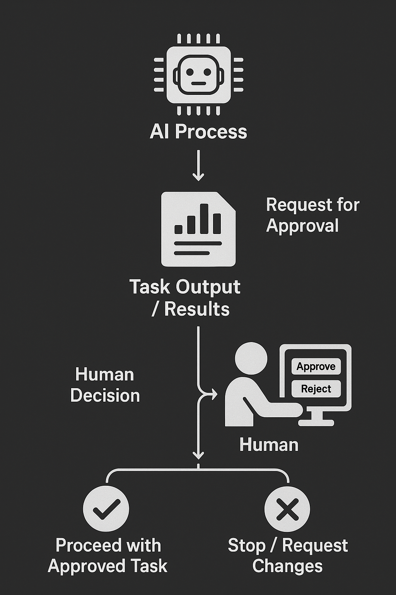

Human-in-the-Loop Interaction
=============================

.. _human_in_the_loop:

This guide explains how to integrate human users into your AgentConnect workflows using the ``HumanAgent`` class. You'll learn how to implement approval workflows, request human input, and properly handle human responses within your multi-agent systems.

Introduction
-----------

The ``HumanAgent`` class (defined in ``agentconnect/agents/human_agent.py``) serves as the bridge between AI workflows and human users through a terminal interface. It allows AI agents to request human input, approvals, or reviews without requiring a pre-defined conversation structure.

The ``HumanAgent`` supports two distinct interaction patterns:

1. **Direct Chat Session** (via ``start_interaction()``): A dedicated terminal conversation between a human and an AI agent, as shown in the :doc:`first_agent` guide.
2. **Workflow Participant** (via ``run()``): The human agent operates like any other agent in the system, receiving messages from various agents and providing responses as needed.

This guide focuses on the second pattern—integrating a human as a participant in agent workflows.

Human Agent as a Workflow Participant
-----------------------------------

To use the ``HumanAgent`` for approvals, reviews, or input within a workflow, you create and register it like any other agent in your system. The key difference from the direct chat approach is that you start its processing loop with ``run()`` instead of calling ``start_interaction()``.

Here's how to set up a ``HumanAgent`` as a workflow participant:

.. code-block:: python

    # Create a human agent
    human = HumanAgent(
        agent_id="human1",
        name="User",
        identity=human_identity,
        organization_id="org1"
    )
    
    # Register with the hub
    await hub.register_agent(human)
    
    # Start the human agent's processing loop
    human_task = asyncio.create_task(human.run())

With this setup, the human agent is now available to receive messages from any other agent in the system and respond to them through the terminal.

Workflow: AI Sends Request to Human
---------------------------------

In a typical workflow, an AI agent sends a message to the human agent requesting some form of input or approval:

.. code-block:: python

    # AI agent sends a request to the human agent
    await ai_agent.send_message(
        receiver_id=human.agent_id,
        content="Task completed: Report generated. Please review and respond 'approve' or 'request changes [your comments]'.",
        message_type=MessageType.TEXT
    )

The message is routed through the ``CommunicationHub`` to the ``HumanAgent``, which then processes it using its ``process_message`` method.

Human Interaction Flow (The Terminal Experience)
---------------------------------------------

When the ``HumanAgent`` (running via its ``run()`` loop) receives a message, the following sequence occurs in the terminal where your Python script is running:

1. The message content appears in the terminal, prefixed with the sender's ID:

   .. code-block:: text

      ai1:
      Task completed: Report generated. Please review and respond 'approve' or 'request changes [your comments]'.
      ----------------------------------------

2. The ``HumanAgent`` immediately prints a prompt showing available commands:

   .. code-block:: text

      Type your response or use these commands:
      - 'exit', 'quit', or 'bye' to end the conversation
      - Press Enter without typing to skip responding
   
      You: 

3. The script execution **pauses** at this point, waiting for the human to type a response, using ``aioconsole.ainput`` to capture the input.

This interaction happens directly in the terminal where you're running your script—there's no separate interface.

Human Provides Input
------------------

The human (you, running the script) has three options when the ``HumanAgent`` prompts for input:

1. **Type a response**: Whatever is typed will be sent back to the AI agent that sent the original message.

   .. code-block:: text

      You: approve

2. **Press Enter without typing**: If the human presses Enter without typing anything, the ``HumanAgent`` logs this action but doesn't send any message back to the AI agent.

   .. code-block:: text

      You: 
      No response sent.

3. **End the conversation**: If the human types "exit", "quit", or "bye", the ``HumanAgent`` sends a special STOP message to the AI agent and ends that conversation.

   .. code-block:: text

      You: exit
      Ending conversation with ai1

Response Sent Back to AI
----------------------

When the human types a response, the ``HumanAgent`` packages it into a standard ``Message`` object and sends it back to the original AI agent sender via the ``CommunicationHub``:

1. The human's input is captured by ``aioconsole.ainput``
2. The ``HumanAgent`` creates a ``Message`` with the input as content
3. The message is sent back to the original sender (the AI agent)
4. The AI agent can then process this response in its own ``process_message`` method

Use Case Example: Approval Workflow
---------------------------------

A common use case for human-in-the-loop integration is an approval workflow, where an AI agent requires human approval before proceeding with a task:

*Approval workflow with human-in-the-loop participation*

The typical flow is:

1. AI agent performs a task or analysis
2. AI agent sends results to human agent for review
3. Human agent displays the message in the terminal and prompts for input
4. Human user types "approve" or "reject" (with optional comments)
5. Human agent sends the response back to the AI agent
6. AI agent proceeds based on the human's decision

Code Example: Human Approval Workflow
-----------------------------------

Here's a complete example demonstrating a human approval workflow:

.. code-block:: python

    import asyncio
    import os
    from dotenv import load_dotenv
    
    from agentconnect.agents import AIAgent, HumanAgent
    from agentconnect.communication import CommunicationHub
    from agentconnect.core.registry import AgentRegistry
    from agentconnect.core.types import (
        AgentIdentity, 
        Capability, 
        InteractionMode, 
        ModelName, 
        ModelProvider,
        MessageType
    )
    
    async def main():
        # Load environment variables
        load_dotenv()
        
        # Initialize registry and hub
        registry = AgentRegistry()
        hub = CommunicationHub(registry)
        
        # Create agent identities
        human_identity = AgentIdentity.create_key_based()
        ai_identity = AgentIdentity.create_key_based()
        
        # Create a human agent
        human = HumanAgent(
            agent_id="human1",
            name="User",
            identity=human_identity,
            organization_id="org1"
        )
        
        # Create an AI agent
        ai_assistant = AIAgent(
            agent_id="ai1",
            name="Assistant",
            provider_type=ModelProvider.OPENAI,
            model_name=ModelName.GPT4O,
            api_key=os.getenv("OPENAI_API_KEY"),
            identity=ai_identity,
            capabilities=[Capability(
                name="data_analysis",
                description="Analyze data and provide insights",
                input_schema={"data": "string"},
                output_schema={"analysis": "string"},
            )],
            interaction_modes=[InteractionMode.HUMAN_TO_AGENT, InteractionMode.AGENT_TO_AGENT],
            personality="professional and thorough",
            organization_id="org1",
        )
        
        # Register both agents with the hub
        await hub.register_agent(human)
        await hub.register_agent(ai_assistant)
        
        # Start both agent processing loops
        human_task = asyncio.create_task(human.run())
        ai_task = asyncio.create_task(ai_assistant.run())
        
        try:
            # Simulate AI agent performing a task
            print("AI agent performing analysis...")
            await asyncio.sleep(2)  # Simulate work
            
            analysis_result = "Based on the data, I recommend Strategy A with 78% confidence."
            
            # AI sends results to human for approval
            print("AI agent requesting human approval...")
            await ai_assistant.send_message(
                receiver_id=human.agent_id,
                content=f"I've completed my analysis:\n\n{analysis_result}\n\nDo you approve this recommendation? (Type 'approve' or 'reject')",
                message_type=MessageType.TEXT
            )
            
            # At this point, the human will see the message in their terminal
            # and will be prompted to respond. The script will wait at this point.
            
            # Let the interaction run for a while
            print("Waiting for human interaction (30 seconds)...")
            await asyncio.sleep(30)
            
        finally:
            # Cleanup
            print("Shutting down agents...")
            await ai_assistant.stop()
            await human.stop()
            await hub.unregister_agent(human.agent_id)
            await hub.unregister_agent(ai_assistant.agent_id)
            print("Done.")
    
    if __name__ == "__main__":
        asyncio.run(main())

Notice that we **do not call** ``human.start_interaction()`` in this example. Instead, we start the human agent's processing loop with ``human.run()``, allowing it to participate in the workflow like any other agent.

Running the Workflow Example
-------------------------

When you run this script:

1. The AI agent performs its analysis
2. It sends a message to the human agent requesting approval
3. **You** (as the human user) will see this message appear directly in the terminal where the script is running
4. You'll be prompted to type your response
5. Whatever you type will be sent back to the AI agent

Remember, when running this script, **you are the Human Agent**. The messages will appear directly in the terminal where you launched the script, and you'll be expected to type responses there.

Advanced: Response Callbacks
-------------------------

The ``HumanAgent`` supports response callbacks that allow you to track and react to human responses programmatically. This is particularly useful for:

- Detecting when a human has provided input
- Triggering other system actions based on human responses
- Implementing timeouts for human input
- Logging or auditing human decisions

To use callbacks, provide a list of functions when creating the ``HumanAgent``:

.. code-block:: python

    # Define a callback function
    def on_human_response(response_data):
        print(f"Human responded: {response_data['content']}")
        
        # Check if the human approved or rejected
        if response_data['content'].lower() == 'approve':
            print("Human approved! Proceeding with task...")
            # Trigger additional system actions
        elif response_data['content'].lower() == 'reject':
            print("Human rejected. Cancelling task...")
    
    # Create the human agent with the callback
    human = HumanAgent(
        agent_id="human1",
        name="User",
        identity=human_identity,
        organization_id="org1",
        response_callbacks=[on_human_response]  # Add our callback
    )

You can also add or remove callbacks after creating the agent:

.. code-block:: python

    # Add a callback later
    human.add_response_callback(another_callback)
    
    # Remove a callback
    human.remove_response_callback(on_human_response)

The callback function receives a dictionary with information about the response:

- ``receiver_id``: The ID of the agent receiving the human's message
- ``content``: The text content of the human's message
- ``message_type``: The type of message (TEXT, STOP, etc.)
- ``timestamp``: When the response was sent

This can be especially useful for implementing timeout mechanisms or coordinating complex workflows that depend on human input.

Next Steps
---------

Now that you understand how to integrate humans into agent workflows, you can:

- Explore more complex multi-agent systems in the :doc:`multi_agent_setup` guide
- Learn about collaborative agent workflows in the :doc:`collaborative_workflows` guide
- Discover how to enhance agents with external tools in the :doc:`external_tools` guide 