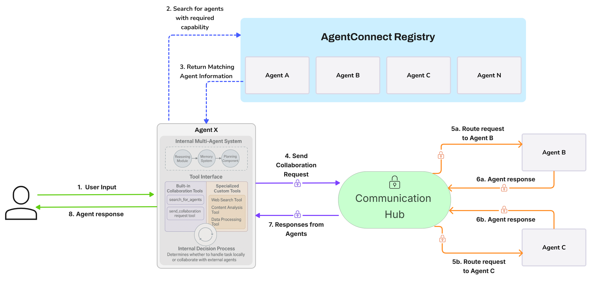

.. AgentConnect documentation master file, created by
   sphinx-quickstart on Thu Mar 13 13:21:07 2025.
   You can adapt this file completely to your liking, but it should at least
   contain the root `toctree` directive.

.. raw:: html

   
   
   <h1>AgentConnect</h1>
   
   
<em>A Decentralized Framework for Autonomous Agent Collaboration</em>

   
   
<strong>Build and connect independent AI agents that discover, interact, and collaborate securely.</strong>

   
   

   <a href="#installation">Installation</a> •
   <a href="#quick-start">Quick Start</a> •
   <a href="examples/index.html">Examples</a> •
   <a href="#documentation">Documentation</a>
   

   

Overview
========

**AgentConnect provides a framework for building decentralized networks of truly autonomous AI agents, enabling the next generation of collaborative AI.**

Move beyond traditional, centrally controlled systems and embrace an ecosystem where independent agents can:

*   **Discover peers on-demand:** Locate partners via **capability broadcasts** instead of hard-wired endpoints.  
*   **Interact Securely (A2A):** Leverage built-in cryptographic verification for **trustworthy Agent-to-Agent** communication.
*   **Execute Complex Workflows:** Request services, exchange value, and achieve goals collectively.
*   **Autonomous Operation:** Each agent hosts its own logic—no central brain required.
*   **Scale Limitlessly:** Support thousands of agents interacting seamlessly.

Why AgentConnect?
----------------

AgentConnect delivers unique advantages over classic multi-agent approaches:

*   **Decentralized Architecture:** No central router, no single point of failure.
*   **First-class agent autonomy:** Agents negotiate, cooperate, and evolve independently.
*   **Interconnect Agent Systems:** Operates above internal frameworks, linking entire agent swarms.
*   **Living ecosystem:** The network fluidly adapts as agents join, leave, or evolve their skills.
*   **Secure A2A Communication:** Crypto-grade identity & message signing baked in.
*   **Horizontal scalability:** Engineered for planet-scale agent populations.
*   **Plug-and-play extensibility:** Easily integrate custom agents, capabilities, and protocols.
*   **Integrated Agent Economy:** Seamless A2A payments powered by **Coinbase CDP & AgentKit**.

Key Features
=============

.. raw:: html

   

     

       <h3>🤖 Dynamic Agent Discovery</h3>
       <ul>
         <li>Capability-Based lookup</li>
         <li>Decentralized Registry</li>
         <li>Zero static links</li>
       </ul>
     

     

       <h3>⚡ A2A Communication</h3>
       <ul>
         <li>Direct Agent-to-Agent Messaging</li>
         <li>Cryptographic signatures</li>
         <li>No routing bottlenecks</li>
       </ul>
     

     

       <h3>⚙️ True Agent Autonomy</h3>
       <ul>
         <li>Independent Operation & Logic</li>
         <li>Self-Managed Lifecycles</li>
         <li>Unrestricted Collaboration</li>
       </ul>
     

   

   
   

     

       <h3>🔒 Trust Layer</h3>
       <ul>
         <li>Verifiable identities</li>
         <li>Tamper-proof messages</li>
         <li>Standard Security Protocols</li>
       </ul>
     

     

       <h3>💰 Built-in Agent Economy</h3>
       <ul>
         <li>Autonomous A2A Payments</li>
         <li>Coinbase CDP Integration</li>
         <li>Instant service settlement</li>
       </ul>
     

     

       <h3>🔌 Multi-LLM Support</h3>
       <ul>
         <li>OpenAI, Anthropic, Groq, Google</li>
         <li>Flexible AI Core Choice</li>
         <li>Vendor-Agnostic Intelligence</li>
       </ul>
     

   

   
   

     

       <h3>📊 Deep Observability</h3>
       <ul>
         <li>LangSmith tracing</li>
         <li>Monitor tools & payments</li>
         <li>Custom Callbacks</li>
       </ul>
     

     

       <h3>🌐 Dynamic Capability Advertising</h3>
       <ul>
         <li>Agent Skill Broadcasting</li>
         <li>Market-Driven Discovery</li>
         <li>On-the-Fly Collaboration</li>
       </ul>
     

     

       <h3>🔗 Native Blockchain Integration</h3>
       <ul>
         <li>Coinbase AgentKit Ready</li>
         <li>On-Chain Value Exchange</li>
         <li>Configurable networks</li>
       </ul>
     

   

Architecture
=============

AgentConnect is built on three core pillars that enable decentralized agent collaboration:

.. raw:: html

   

     

       <h3>1. Decentralized Agent Registry</h3>
       
A registry that allows agents to publish capabilities and discover other agents. This is <em>not</em> a central controller, but a directory service that agents can query to find collaborators that meet their needs.

     

     

       <h3>2. Communication Hub</h3>
       
A message routing system that facilitates secure peer-to-peer communication. The hub ensures reliable message delivery but does <em>not</em> dictate agent behavior or control the network.

     

     

       <h3>3. Independent Agent Systems</h3>
       
Each agent is a self-contained unit built using tools and frameworks of your choice. Agents interact through standardized protocols, while their internal operations remain independent.

     

   

   
   Detailed workflow showing how agents discover, communicate, and collaborate

.. _installation:

Installation
==============

.. attention::
   AgentConnect is currently available from source only. Direct installation via pip will be available soon.

Prerequisites
------------

- Python 3.11 or higher
- Poetry (Python package manager)

AgentConnect can be installed by cloning the repository and using Poetry to install dependencies. 

.. code-block:: bash

    # Clone the repository
    git clone https://github.com/AKKI0511/AgentConnect.git
    cd AgentConnect

    # Install dependencies
    poetry install

For detailed installation instructions including environment setup and API configuration, see the :doc:`installation` guide.

.. _quick-start:

Quick Start
=============

Here's a minimal example of creating and connecting a human user with an AI assistant:

.. code-block:: python

    import asyncio
    import os
    from agentconnect.agents import AIAgent, HumanAgent
    from agentconnect.core.registry import AgentRegistry
    from agentconnect.communication import CommunicationHub
    from agentconnect.core.types import ModelProvider, ModelName, AgentIdentity, InteractionMode

    async def main():
        # Create registry and hub
        registry = AgentRegistry()
        hub = CommunicationHub(registry)
        
        # Create and register an AI agent
        ai_agent = AIAgent(
            agent_id="assistant",
            name="AI Assistant",
            provider_type=ModelProvider.OPENAI,
            model_name=ModelName.GPT4O,
            api_key=os.getenv("OPENAI_API_KEY"),
            identity=AgentIdentity.create_key_based(),
            interaction_modes=[InteractionMode.HUMAN_TO_AGENT]
        )
        await hub.register_agent(ai_agent)
        
        # Create and register a human agent
        human = HumanAgent(
            agent_id="human-user",
            name="Human User",
            identity=AgentIdentity.create_key_based()
        )
        await hub.register_agent(human)

        # Start AI processing loop
        asyncio.create_task(ai_agent.run())
        
        # Start interaction between human and AI
        await human.start_interaction(ai_agent)

    if __name__ == "__main__":
        asyncio.run(main())

For more detailed examples and step-by-step instructions, see the :doc:`quickstart` guide.

.. _examples:

Documentation
=============

.. toctree::
   :maxdepth: 2
   :caption: Getting Started

   installation
   quickstart
   
.. toctree::
   :maxdepth: 2
   :caption: User Guides

   guides/index
   examples/index

.. toctree::
   :maxdepth: 2
   :caption: Reference

   api/index
   
.. toctree::
   :maxdepth: 2
   :caption: Development

   contributing
   code_of_conduct
   changelog

Roadmap
=======

- ✅ **MVP with basic agent-to-agent interactions**
- ✅ **Autonomous communication between agents**  
- ✅ **Capability-based agent discovery**
- ✅ **Coinbase AgentKit Payment Integration**
- ⬜ **Agent Identity & Reputation System**
- ⬜ **Marketplace-Style Agent Discovery**
- ⬜ **MCP Integration**
- ⬜ **Structured Parameters SDK**
- ⬜ **Secure data exchange protocols**
- ⬜ **Additional AI provider integrations**
- ⬜ **Advanced memory systems (Redis, PostgreSQL)**
- ⬜ **Federated learning capabilities**
- ⬜ **Cross-chain communication support**

.. raw:: html

   

     
<a href="https://github.com/AKKI0511/AgentConnect" class="github-button">⭐ Star us on GitHub</a>

     
Built with ❤️ by the AgentConnect team

   

.. Add custom CSS for the feature grid and other elements
.. raw:: html

    
